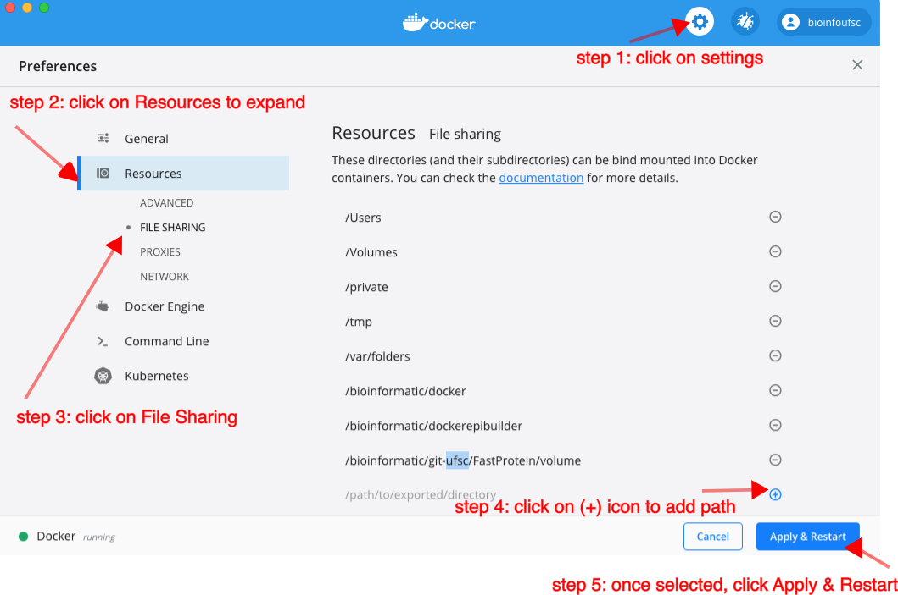
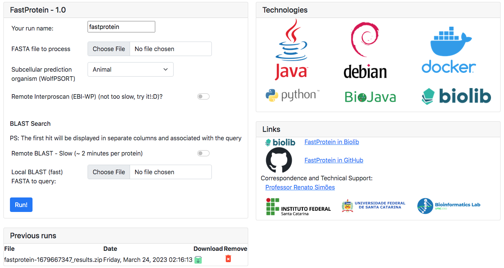

<!-- MARKDOWN LINKS & IMAGES ----------------------------------------------- -->
<!-- https://www.markdownguide.org/basic-syntax/#reference-style-links -->

[![License][apache-shield]][apache-url]
[![BioLib][biolib-shield]][biolib-url]

[apache-url]: https://opensource.org/licenses/Apache-2.0
[apache-shield]: https://img.shields.io/badge/License-Apache_2.0-blue.svg
[biolib-url]: https://biolib.com/ufsc/FastProtein
[biolib-shield]: https://img.shields.io/badge/Online%20Server-BioLib-brightgreen

<font color="#4682b4">

<br />
<div align="center">
  <!-- <a href="https://github.com/othneildrew/Best-README-Template">
    
  </a> -->


### _A fast, easy, and cost-free way for you to learn more about your proteins =)_

  <p align="center">
    <!-- <br />
    <a href="https://github.com/othneildrew/Best-README-Template"><strong>Explore the docs »</strong></a>
    <br /> -->
  </p>
</div>

<!-- TABLE OF CONTENTS ----------------------------------------------------- -->

<details>
  <summary>Table of Contents</summary>
  <ol>
    <li>
      <a href="#about-fastprotein">About FastProtein</a>
      <ul>
        <li><a href="#expected-results">Expected Results</a></li>
      </ul>
    </li>
    <li><a href="#installation">Installation</a></li>
    <li>
      <a href="#usage">Usage</a>
      <ul>
        <li><a href="#Docker">Docker</a></li>
        <li><a href="#biolib">BioLib</a></li>
      </ul>
    </li>
    <li><a href="#contact-info">Contact Info</a></li>
    <li><a href="#citation-and-acknowledgments">Citation and Acknowledgments</a></li>
  </ol>
</details>

<!-- ABOUT THE PROJECT ----------------------------------------------------- -->

## **About FastProtein**

> _Developed by the <a href='https://bioinformatica.ufsc.br/'>Bioinformatics Laboratory - UFSC</a>  and <a href="www.ifsc.edu.br">IFSC</a> under the responsibility of Professor <a mailto='renato.simoes@ifsc.edu.br'>PhD. Renato Simões Moreira.</a>_

<p>
FastProtein is a software developed in Java that brings together various protein characteristics. We use the main prediction players and organize them into various files and images so that you can have information quickly and easy.
</p>

<p>
We use Docker technology for the development of a Linux image (based on Debian) with all the necessary installation not only to run FastProtein but also all the bioinformatics software we use in the pipeline. This way, you don't have just a Docker for a single tool but for multiple ones.
</p>
<p>
If you have questions, suggestions or difficulties regarding the pipeline, please do not hesitate to contact our team here on GitHub or by <a mailto="labioinfo.genome@gmail.com">Bioinformatics Lab (UFSC)</a>.
</p>


<p align="right">(<a href="#readme-top">back to top</a>)</p>

---

## **Output Results**

### FastProtein can evaluate multiple protein parameters in a single run. As output, user obtain a table with:
<p>&ensp;</p>

- **ID:** Protein ID from your FASTA file

- **Length:** The length of the protein sequence

- **kDa:** Molecular mass in kilodaltons

- **Isoelectric Point:** Isoelectric point of the full protein sequence

- **Hydropathy:** Hydropathy index of the full protein sequence

- **Aromaticity:** Aromaticity index of the full protein sequence

- **Membrane Evidence:** We provide in silico evidence of proteins related to the membrane

- **Subcellular Localization Prediction:** Prediction of the protein's subcellular localization using [WoLF PSORT](https://wolfpsort.hgc.jp)

- **Prediction of Transmembrane Helices in Proteins:** Prediction of transmembrane helices in proteins using [TMHMM-2.0c](https://services.healthtech.dtu.dk/service.php?TMHMM-2.0) and [Phobius](https://phobius.sbc.su.se)

- **Prediction of Signal Peptides:** Prediction of signal peptides using [SignalP-5](https://services.healthtech.dtu.dk/service.php?SignalP-5.0) and [Phobius](https://phobius.sbc.su.se)

- **GPI-Anchored Proteins:** Prediction of GPI-anchored proteins using [PredGPI](https://github.com/BolognaBiocomp/predgpi)

- **Endoplasmic Reticulum Retention domains** (peptide and position) - [E.R Retention Domain](https://prosite.expasy.org/PDOC00014).

- **N-Glycosylation domains** (peptide and position) - [N-Glyc Domain](https://prosite.expasy.org/PDOC00001).

- **Header:** Protein header

- **Gene Ontology, Panther, and Pfam:** Protein function and annotation using [InterProScan5](https://www.ebi.ac.uk/interpro)

- **Charts**

- **Alignment** by [Diamond](https://github.com/bbuchfink/diamond) and [Blast](https://ftp.ncbi.nlm.nih.gov/blast/executables/blast+/LATEST/)

- **and much more**...

<p align="right">(<a href="#top">back to top</a>)</p>

---
## **Technologies**

<!--
[debian-url]: https://www.debian.org
[debian-shield]: https://img.shields.io/badge/Debian-A81D33?style=for-the-badge&logo=debian&logoColor=white
[docker-url]: https://www.docker.com/
[docker-shield]: https://img.shields.io/badge/Docker-2496ED?style=for-the-badge&logo=docker&logoColor=white
[java-url]: https://www.java.com
[java-shield]: https://img.shields.io/badge/Java-ED8B00?style=for-the-badge&logo=java&logoColor=white
[python-url]: https://www.python.org
[python-shield]: https://img.shields.io/badge/Python-14354C?style=for-the-badge&logo=python&logoColor=white


[![Debian][debian-shield]][debian-url]

[![Docker][docker-shield]][docker-url]

[![Java][java-shield]][java-url]

[![Python][python-shield]][python-url]
-->
<p align="center">
  <a href="https://www.debian.org">
    
  </a><a>&ensp;</a>
  <a href="https://www.docker.com/">
    
  </a><a>&ensp;</a>
    <a href="https://www.python.org">
    
</p>
<p align="center">  
  </a><a>&ensp;</a>
    <a href="https://www.java.com">
    
  </a><a>&ensp;</a>
    <a href="https://biojava.org/">
    
  </a><a>&ensp;</a>
    <a href="https://biolib.com/">
    
  </a><a>&ensp;</a>
</p>
<!--blank line-->
<p>&ensp;</p>


<p align="right">(<a href="#top">back to top</a>)</p>

<!-- GETTING STARTED ------------------------------------------------------- -->
## **Installation**

### **If you want to create a local image Docker from scratch (optional)**

1. Clone the repository

   ```bash
   git clone https://github.com/bioinformatics-ufsc/FastProtein
   ```

2. Change directory and build container

   ```bash
   cd FastProtein/docker
   docker build -t bioinfoufsc/fastprotein:latest .
   ```
#

### **Get a image from DockerHub (recommended)**

1. Pull an image to host (clean, without InterProScan) - 
```bash
   #Light version 900Mb compressed
   docker pull bioinfoufsc/fastprotein:latest
```
2. Pull a image to host (with InterProScan)
```bash
   #Full version with interpro installed (don't need to execute Step 4, just change the image name in the end of the command)
   docker pull bioinfoufsc/fastprotein-interproscan:latest
```

### **Controlling Docker container (mandatory)**
    
   ```bash
   # Step 1 - Create a local directory that will be used to exchange files with Docker (example fastprotein/ inside user home)
   #          ~/fastprotein is the work directory
   #          ~/fastprotein/runs the directory that stores the FastProtein web server requests
   #          
   mkdir -p <your_home>/fastprotein/runs
   
   # Step 2 - File sharing - If you are using MacOS you have to share your folder before go to Step 3
  ```
   <p align="center">
      <a>
      
    </a>
    </p>
    
   ```bash
   # Step 3 - Create a container named FastProtein that will have the volume associated with the locally created directory. 
   #          Port 5000 is used to access the FastProtein web server.
   #          PS 1: this command is executed only one time and it will create and start your container
   docker run -d -it --name FastProtein -p 5000:5000 -v <your_home>/fastprotein:/fastprotein bioinfoufsc/fastprotein:latest
   # Step 3.1 - If you have InterProScan on your host, you can direct it to the FastProtein Docker InterProScan directory as follows.
   #          The supported version is interproscan-5.61-93.0 (http://ftp.ebi.ac.uk/pub/software/unix/iprscan/5/5.61-93.0/interproscan-5.61-93.0-64-bit.tar.gz)
   docker run -d -it --name FastProtein -p 5000:5000 -v <your_home>/fastprotein:/fastprotein -v <your_interpro_home>:/bioinformatic/interproscan-5.61-93.0 bioinfoufsc/fastprotein:latest
   #
   # Step 4 - InterProScan installation
   #          This step may take ~1 hour total
   docker exec -it FastProtein interpro_install
   
   # The 'docker run' command starts the container for the first time. 
   # If everything runs without errors, open a browser and go to 127.0.0.1:5000 to access the FastProtein web.
   
   # The following commands are for you to learn how to control a Docker container.
   # If you want to STOP the container, the command is:
   docker stop FastProtein
   # If you want to START the container, the command is:
   docker start FastProtein
   # To check if your container is running, the command is:
   docker ps | grep FastProtein
   # If you want to enter inside the container, the command is:
   docker exec -it FastProtein /bin/bash 
  # To exchange files between the host and the container without using a volume, use the command:
  # docker cp <local_file> <container_id>:<container_file>
  # E.g: copy a fasta file test/human.fasta to /fastprotein (or other directory if you need)
  docker cp test/human.fasta FastProtein:/fastprotein
  # E.g: copy the folder runs from container to local runs folder
  docker cp FastProtein:/fastprotein/runs ./runs
```


<p align="right">(<a href="#top">back to top</a>)</p>

<!-- USAGE ----------------------------------------------------------------- -->
---
## **Usage**
### **FastProtein Web Server**

<p>Default IP is 127.0.0.1 and exposed port is 5000.

Just open the following link in a browser and FastProtein local service will be up and running: (<a href="http://127.0.0.1:5000" target='_blank'>127.0.0.1:5000</a>)

Results will be redirect to directory `/fastproteins/runs` linked with the local folder `~/fastproteins/runs`.
A list of zip files is showed in the web page.
</p>

### **Server Screen**
<p align="center">
  <a>
    
  </a>
</p>

#
### **Using via docker container (local)**

```bash
## To learn about the execution parameters, type:
docker exec -it FastProtein fastprotein -h
## Example of execution:
##        input.fasta - proteins to analyze
##        db.fasta - database for blast search (protein FASTA)
##        result_test - local inside the container with the results (/fastprotein/result_test is linked with the local folder ~/fastprotein/result_test)
docker exec -it FastProtein fastprotein -i /example/input.fasta -db /example/db.fasta -o result_test
```

#
#### **Using inside the docker container**
```bash
## Enter into container
docker exec -it FastProtein /bin/bash 
##
## Execute the command:
fastprotein -h
##
## Simplest execution (the default output is fastprotein_results)
fastprotein -i /example/input.fasta 
##
## Example of a complete execution (with InterproScan and BlastP) with output in folder result_test
fastprotein -i /example/input.fasta -db /example/db.fasta --interpro -o result_test
##
## The same example but with output in zip mode
fastprotein -i /example/input.fasta -db /example/db.fasta --interpro -o result_test --zip
```
---

### **BioLib**

<p>FastProtein has an online service for small datasets (~100 proteins). 
This limitation is not from FastProtein, but rather from the web service that can generate a timeout.
</p>

This service is available at: (<a href="https://biolib.com/UFSC/FastProtein" target='_blank'>https://biolib.com/UFSC/FastProtein</a>)

#### **Running BioLib locally using the command line**

Alternatively, you can run FastProtein via biolib through the command line. To do this, install biolib and execute the command.
Required python 3 and pip3.

```bash
##Installing BioLib before Run
pip3 install -U pybiolib
##Running help - This process will download a customized docker image in your host (~50GB) to execute FastProtein
biolib run UFSC/FastProtein --help
```

<p>&ensp;</p>

BioLib has a specific syntax and the flags `--interpro` needed a `true` or `false` value in the command line. 
The default BioLib output is `biolib_results/` in the current folder
Check the Example:

```bash
biolib run UFSC/FastProtein -i input.fasta --interpro true
```

##Output console
It is possible to see all the commands running using the flag -log ALL in command line.

##Use your FastProtein container as your Bioinformatic tools
In the FastProtein container, it is possible to run the software used within the pipeline as follows:

```bash
  ## WoLFPSORT (output = <local_execution_folder>/wolfsort.out)
  docker exec -it FastProtein2 wolfpsort animal /example/input.fasta > wolfpsort.out
  ## SignalP5 (output = <local_execution_folder>/signalp.out)
  docker exec -it FastProtein2 signalp -fasta /example/input.fasta -stdout > signalp.out
  ##Phobius (output = <local_execution_folder>/phobius.out)
  docker exec -it FastProtein2 phobius -short /example/input.fasta > phobius.out
  #TMHMM2 (output = <local_execution_folder>/tmhmm.out)
  docker exec -it FastProtein2 tmhmm2 /example/input.fasta > tmhmm2.out
  #PredGPI (output = <local_execution_folder>/predgpi.out)
  docker exec -it FastProtein2 predgpi /example/input.fasta > predgpi.out
  #InterProScan5 (output = <shared_folder>/interpro.out)
  docker exec -it FastProtein interproscan -i /example/input.fasta -f tsv -o interpro.out --goterms
```

<b>Remember, the results are stored INSIDE the docker and will reflect in your local folder only if the output is set to <i>/fastprotein/</i></b>

<p align="right">(<a href="#top">back to top</a>)</p>

<!-- CONTACT -->
---
## **Contact Info**


[ufsc-url]: https://ufsc.br/
[ufsc-shield]: https://external-content.duckduckgo.com/iu/?u=https%3A%2F%2Flogodownload.org%2Fwp-content%2Fuploads%2F2015%2F02%2Fufsc-logo-1-140x140.png&f=1&nofb=1&ipt=211156b56538b57afb3fbfab6e4c96c77572f6d1ff3daa8a0240ff714352c390&ipo=images
[ifsc-url]: https://www.ifsc.edu.br/
[ifsc-shield]: https://www.ifsc.edu.br/image/layout_set_logo?img_id=902745&t=1677950696306
[bioinfo-url]: https://bioinformatica.ufsc.br
[bioinfo-shield]: https://bioinformatica.ufsc.br/files/2020/02/cropped-Logo-V-C.png
[ig-url]: https://www.instagram.com/labioinfoufsc
[ig-shield]: https://img.shields.io/badge/Instagram-E4405F?style=for-the-badge&logo=instagram&logoColor=white
[gmail-url]: mailto:labioinfo.genome@gmail.com
[gmail-shield]: https://img.shields.io/badge/Gmail-D14836?style=for-the-badge&logo=gmail&logoColor=white
[ig-url]: https://www.instagram.com/labioinfoufsc
[ig-shield]: https://img.shields.io/badge/Instagram-E4405F?style=for-the-badge&logo=instagram&logoColor=white

<!---
[![ufsc][ufsc-shield]][ufsc-url] 
[![ifsc][ifsc-shield]][ifsc-url] 
[![bioinfo][bioinfo-shield]][bioinfo-url] 
-->

<p align="center">
  <a href="https://bioinformatica.ufsc.br">
    
  </a><a>&ensp;</a>
  <a href="https://www.ifsc.edu.br/">
    
  </a><a>&ensp;</a>
  <a href="https://ufsc.br/">
    
  </a><a>&ensp;</a>
</p>

<!--blank line-->
<p>&ensp;</p>

<p align="center">
  <a href="mailto:labioinfo.genome@gmail.com">
    
  </a>
  <a href="https://www.instagram.com/labioinfoufsc">
    
  </a>
</p>


<!--
[github-url]: https://github.com/bioinformatics-ufsc/FastProtein
[github-shield]:https://img.shields.io/badge/GitHub-100000?style=for-the-badge&logo=github&logoColor=white

[![github][github-shield]][github-url]

-->

<p>&ensp;</p>

### **Project Links:**
<p align="center">
  <a href="https://biolib.com/ufsc/FastProtein">
    
  </a>
  <a href="https://github.com/bioinformatics-ufsc/FastProtein">
    
  </a>
</p>


<p align="right">(<a href="#top">back to top</a>)</p>

## **Citation and Acknowledgments**

This software was developed using Java 17 (please cite [BioJava](https://biojava.org)) and Python 3.

Please cite us: 

FastProtein also uses a suite of software, please cite them too:

- WoLF PSORT - [Horton et al., 2007](https://doi.org/10.1093/nar/gkm259)
- TMHMM-2.0 - [Krogh et al., 2001](https://doi.org/10.1006/jmbi.2000.4315)
- Phobius - [Käll et al., 2004](http://dx.doi.org/10.1016/j.jmb.2004.03.016)
- SignalP-5 - [Armenteros et al., 2019](https://doi.org/10.1038/s41587-019-0036-z)
- PredGPI - [Pierleoni, A; Marteli P.L. and Casadio R., 2008](https://doi.org/10.1186/1471-2105-9-392)
- PROSITE - [Sigrist et al., 2012](https://doi.org/10.1093/nar/gks1067)
- InterProScan5 - [Blum et al., 2020](https://doi.org/10.1093/nar/gkaa977)
- Diamond - [Mai et al., 2018](https://doi.org/10.1093/bioinformatics/bty391)
- BlastP - [Camacho et al., 2009](https://doi.org/10.1186/1471-2105-10-421)

<p align="right">(<a href="#top">back to top</a>)</p>
</font>
