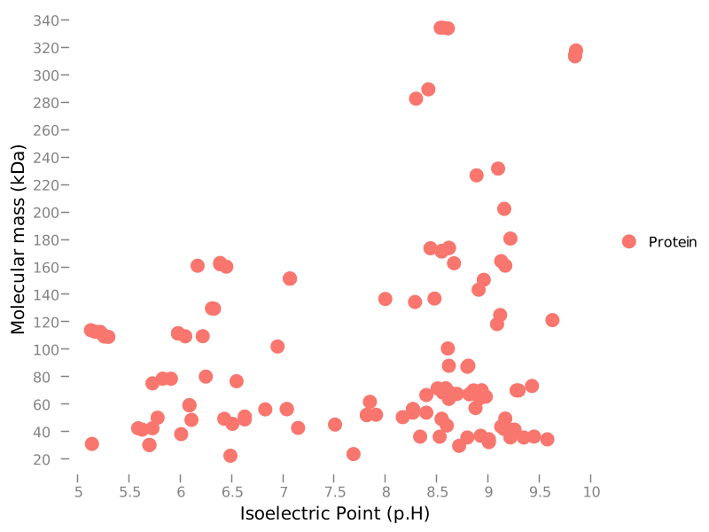
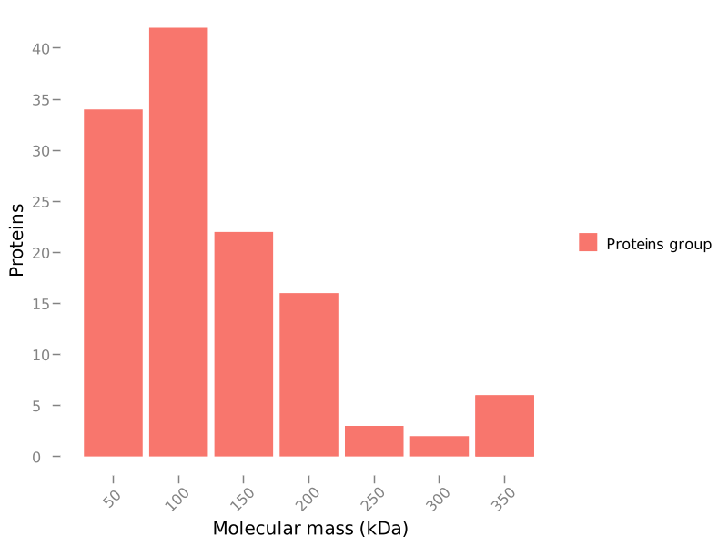
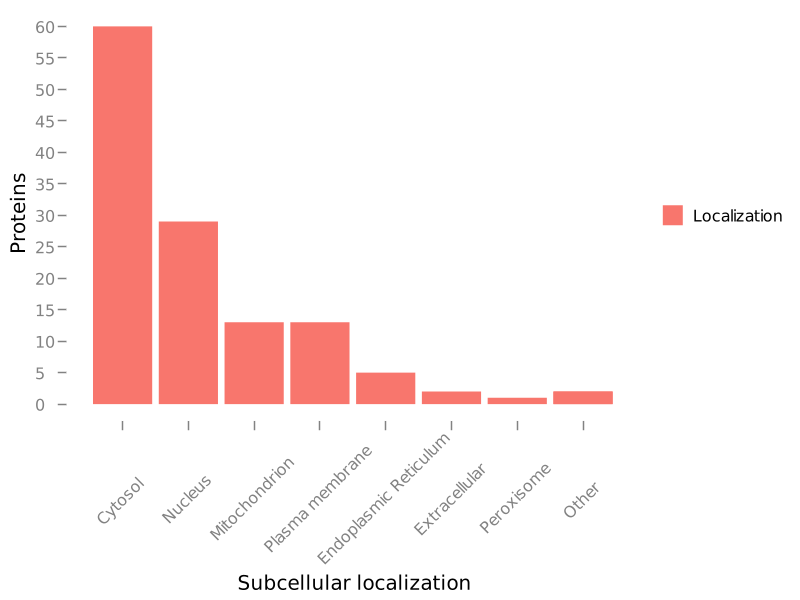
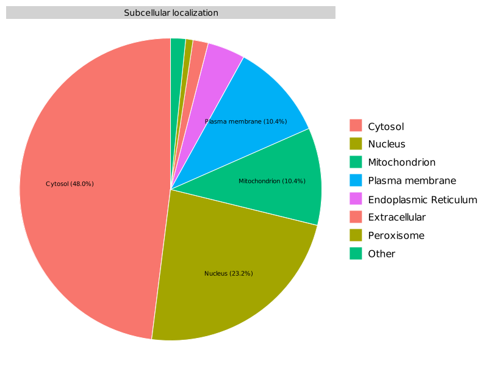

FastProtein Software 1.0
========================
##### Protein Information Software

---
### Summary
| Information                          | Value               |
| ------------------------------------ | ------------------- |
| Processed proteins                   | 125                 |
| Molecular mass (kda) mean            | 100.04 &#177; 73.66 |
| Isoelectric point mean               | 7.80 &#177; 1.37    |
| Hydrophicity mean                    | -0.50 &#177; 0.32   |
| Aromaticity mean                     | 0.09 &#177; 0.03    |
| Proteins with TM                     | 31                  |
| Proteins with SP                     | 11                  |
| Proteins with GPI                    | 3                   |
| Membrane proteins                    | 31                  |
| Proteins with E.R Retention domains  | 37                  |
| Proteins with NGlycosylation domains | 124                 |
### Molecular mass (kDa) vs Isoelectric point (pH)

### Molecular mass (kDa) histogram

---
### Subcellular localization (by WolfPSort) - Organism: animal

| Subcellular localization | Proteins |
| ------------------------ | -------- |
| cyto                     | 60       |
| nucl                     | 29       |
| mito                     | 13       |
| plas                     | 13       |
| E.R.                     | 5        |
| cyto_nucl                | 2        |
| extr                     | 2        |
| pero                     | 1        |
---
### E.R Retention domain summary
| Domain | Quantity |
| ------ | -------- |
| QNEL   | 6        |
| KEEL   | 7        |
| HDEL   | 3        |
| SQEL   | 4        |
| KDEL   | 3        |
| SNEL   | 5        |
| AEEL   | 4        |
| RNEL   | 3        |
| KNEL   | 8        |
| AQEL   | 3        |
Only top 10

---
### NGlyc domain summary
| Domain | Quantity |
| ------ | -------- |
| NNS    | 121      |
| NLS    | 51       |
| NKT    | 45       |
| NKS    | 49       |
| NIS    | 87       |
| NVS    | 49       |
| NGS    | 48       |
| NES    | 44       |
| NRS    | 53       |
| NSS    | 94       |
Only top 10

---
Gene Ontology
-------------
#### Molecular Function
| GO         | Description                                                                                     | Total |
| ---------- | ----------------------------------------------------------------------------------------------- | -----:|
| GO:0005524 | ATP binding                                                                                     |    32 |
| GO:0003677 | DNA binding                                                                                     |    32 |
| GO:0003824 | catalytic activity                                                                              |    16 |
| GO:0051536 | iron-sulfur cluster binding                                                                     |    11 |
| GO:0016491 | oxidoreductase activity                                                                         |    10 |
| GO:0003678 | DNA helicase activity                                                                           |     9 |
| GO:0003899 | DNA-directed 5'-3' RNA polymerase activity                                                      |     7 |
| GO:0032549 | ribonucleoside binding                                                                          |     7 |
| GO:0051539 | 4 iron, 4 sulfur cluster binding                                                                |     6 |
| GO:0046872 | metal ion binding                                                                               |     5 |
| GO:0008168 | methyltransferase activity                                                                      |     5 |
| GO:0000166 | nucleotide binding                                                                              |     5 |
| GO:0005525 | GTP binding                                                                                     |     5 |
| GO:0004518 | nuclease activity                                                                               |     4 |
| GO:0003676 | nucleic acid binding                                                                            |     4 |
| GO:0050661 | NADP binding                                                                                    |     4 |
| GO:0003918 | DNA topoisomerase type II (double strand cut, ATP-hydrolyzing) activity                         |     4 |
| GO:0016740 | transferase activity                                                                            |     4 |
| GO:0003972 | RNA ligase (ATP) activity                                                                       |     3 |
| GO:0003721 | telomerase RNA reverse transcriptase activity                                                   |     3 |
| GO:0003964 | RNA-directed DNA polymerase activity                                                            |     3 |
| GO:0004019 | adenylosuccinate synthase activity                                                              |     3 |
| GO:0051287 | NAD binding                                                                                     |     3 |
| GO:0016638 | oxidoreductase activity, acting on the CH-NH2 group of donors                                   |     3 |
| GO:0016639 | oxidoreductase activity, acting on the CH-NH2 group of donors, NAD or NADP as acceptor          |     3 |
| GO:0003872 | 6-phosphofructokinase activity                                                                  |     3 |
| GO:0009019 | tRNA (guanine-N1-)-methyltransferase activity                                                   |     3 |
| GO:0000287 | magnesium ion binding                                                                           |     3 |
| GO:0004634 | phosphopyruvate hydratase activity                                                              |     3 |
| GO:0047334 | diphosphate-fructose-6-phosphate 1-phosphotransferase activity                                  |     3 |
| GO:0016992 | lipoate synthase activity                                                                       |     3 |
| GO:0008452 | RNA ligase activity                                                                             |     3 |
| GO:0008176 | tRNA (guanine-N7-)-methyltransferase activity                                                   |     3 |
| GO:0004609 | phosphatidylserine decarboxylase activity                                                       |     3 |
| GO:0016785 | selenotransferase activity                                                                      |     3 |
| GO:0016787 | hydrolase activity                                                                              |     3 |
| GO:0015930 | glutamate synthase activity                                                                     |     3 |
| GO:0016887 | ATP hydrolysis activity                                                                         |     2 |
| GO:0004386 | helicase activity                                                                               |     2 |
| GO:0004146 | dihydrofolate reductase activity                                                                |     2 |
| GO:0008821 | crossover junction endodeoxyribonuclease activity                                               |     2 |
| GO:0046933 | proton-transporting ATP synthase activity, rotational mechanism                                 |     2 |
| GO:0004812 | aminoacyl-tRNA ligase activity                                                                  |     2 |
| GO:0004616 | phosphogluconate dehydrogenase (decarboxylating) activity                                       |     2 |
| GO:0004813 | alanine-tRNA ligase activity                                                                    |     2 |
| GO:0048487 | beta-tubulin binding                                                                            |     2 |
| GO:0070006 | metalloaminopeptidase activity                                                                  |     2 |
| GO:0019948 | SUMO activating enzyme activity                                                                 |     2 |
| GO:0000829 | inositol heptakisphosphate kinase activity                                                      |     2 |
| GO:0004672 | protein kinase activity                                                                         |     2 |
| GO:0008234 | cysteine-type peptidase activity                                                                |     2 |
| GO:0005515 | protein binding                                                                                 |     2 |
| GO:0051537 | 2 iron, 2 sulfur cluster binding                                                                |     2 |
| GO:0016788 | hydrolase activity, acting on ester bonds                                                       |     2 |
| GO:0061630 | ubiquitin protein ligase activity                                                               |     2 |
| GO:0016747 | acyltransferase activity, transferring groups other than amino-acyl groups                      |     2 |
| GO:0016627 | oxidoreductase activity, acting on the CH-CH group of donors                                    |     2 |
| GO:0009055 | electron transfer activity                                                                      |     2 |
| GO:0008641 | ubiquitin-like modifier activating enzyme activity                                              |     2 |
| GO:0004799 | thymidylate synthase activity                                                                   |     2 |
| GO:0003906 | DNA-(apurinic or apyrimidinic site) endonuclease activity                                       |     2 |
| GO:0019104 | DNA N-glycosylase activity                                                                      |     2 |
| GO:0008080 | N-acetyltransferase activity                                                                    |     2 |
| GO:0008175 | tRNA methyltransferase activity                                                                 |     2 |
| GO:0016818 | hydrolase activity, acting on acid anhydrides, in phosphorus-containing anhydrides              |     2 |
| GO:0004252 | serine-type endopeptidase activity                                                              |     2 |
| GO:0004842 | ubiquitin-protein transferase activity                                                          |     2 |
| GO:0016741 | transferase activity, transferring one-carbon groups                                            |     2 |
| GO:0016620 | oxidoreductase activity, acting on the aldehyde or oxo group of donors, NAD or NADP as acceptor |     2 |
| GO:0036054 | protein-malonyllysine demalonylase activity                                                     |     1 |
| GO:0036055 | protein-succinyllysine desuccinylase activity                                                   |     1 |
| GO:0004784 | superoxide dismutase activity                                                                   |     1 |
| GO:0003723 | RNA binding                                                                                     |     1 |
| GO:0035598 | N6-threonylcarbomyladenosine methylthiotransferase activity                                     |     1 |
| GO:0070403 | NAD+ binding                                                                                    |     1 |
| GO:0035596 | methylthiotransferase activity                                                                  |     1 |
| GO:0047952 | glycerol-3-phosphate dehydrogenase [NAD(P)+] activity                                           |     1 |
| GO:0009922 | fatty acid elongase activity                                                                    |     1 |
| GO:0004114 | 3',5'-cyclic-nucleotide phosphodiesterase activity                                              |     1 |
| GO:0003938 | IMP dehydrogenase activity                                                                      |     1 |
| GO:1990817 | RNA adenylyltransferase activity                                                                |     1 |
| GO:0003865 | 3-oxo-5-alpha-steroid 4-dehydrogenase activity                                                  |     1 |
| GO:0008081 | phosphoric diester hydrolase activity                                                           |     1 |
| GO:0016779 | nucleotidyltransferase activity                                                                 |     1 |
| GO:0042803 | protein homodimerization activity                                                               |     1 |
| GO:0016616 | oxidoreductase activity, acting on the CH-OH group of donors, NAD or NADP as acceptor           |     1 |
| GO:0020037 | heme binding                                                                                    |     1 |
| GO:0008649 | rRNA methyltransferase activity                                                                 |     1 |
| GO:0004129 | cytochrome-c oxidase activity                                                                   |     1 |
| GO:0050660 | flavin adenine dinucleotide binding                                                             |     1 |
#### Cellular Component
| GO         | Description                                                   | Total |
| ---------- | ------------------------------------------------------------- | -----:|
| GO:0042555 | MCM complex                                                   |     9 |
| GO:0005634 | nucleus                                                       |     7 |
| GO:0005737 | cytoplasm                                                     |     4 |
| GO:0016020 | membrane                                                      |     4 |
| GO:0000408 | EKC/KEOPS complex                                             |     3 |
| GO:0000015 | phosphopyruvate hydratase complex                             |     3 |
| GO:0009986 | cell surface                                                  |     3 |
| GO:0005739 | mitochondrion                                                 |     3 |
| GO:0072669 | tRNA-splicing ligase complex                                  |     3 |
| GO:0000974 | Prp19 complex                                                 |     2 |
| GO:0045261 | proton-transporting ATP synthase complex, catalytic core F(1) |     2 |
| GO:0009331 | glycerol-3-phosphate dehydrogenase complex                    |     1 |
| GO:0005852 | eukaryotic translation initiation factor 3 complex            |     1 |
#### Biological Process
| GO         | Description                                              | Total |
| ---------- | -------------------------------------------------------- | -----:|
| GO:0032508 | DNA duplex unwinding                                     |     9 |
| GO:0006270 | DNA replication initiation                               |     9 |
| GO:0006351 | DNA-templated transcription                              |     7 |
| GO:0006096 | glycolytic process                                       |     6 |
| GO:0006099 | tricarboxylic acid cycle                                 |     6 |
| GO:0006260 | DNA replication                                          |     6 |
| GO:0006508 | proteolysis                                              |     6 |
| GO:0006281 | DNA repair                                               |     4 |
| GO:0006164 | purine nucleotide biosynthetic process                   |     4 |
| GO:0006400 | tRNA modification                                        |     4 |
| GO:0006265 | DNA topological change                                   |     4 |
| GO:0006002 | fructose 6-phosphate metabolic process                   |     3 |
| GO:0006259 | DNA metabolic process                                    |     3 |
| GO:0001510 | RNA methylation                                          |     3 |
| GO:0006807 | nitrogen compound metabolic process                      |     3 |
| GO:0001717 | conversion of seryl-tRNAsec to selenocys-tRNAsec         |     3 |
| GO:0006388 | tRNA splicing, via endonucleolytic cleavage and ligation |     3 |
| GO:0006537 | glutamate biosynthetic process                           |     3 |
| GO:0030488 | tRNA methylation                                         |     3 |
| GO:0008654 | phospholipid biosynthetic process                        |     3 |
| GO:0006396 | RNA processing                                           |     3 |
| GO:0009107 | lipoate biosynthetic process                             |     3 |
| GO:0002949 | tRNA threonylcarbamoyladenosine modification             |     3 |
| GO:0032259 | methylation                                              |     3 |
| GO:0034470 | ncRNA processing                                         |     2 |
| GO:0006284 | base-excision repair                                     |     2 |
| GO:0006285 | base-excision repair, AP site formation                  |     2 |
| GO:0016925 | protein sumoylation                                      |     2 |
| GO:0046654 | tetrahydrofolate biosynthetic process                    |     2 |
| GO:0006006 | glucose metabolic process                                |     2 |
| GO:0015986 | proton motive force-driven ATP synthesis                 |     2 |
| GO:0007021 | tubulin complex assembly                                 |     2 |
| GO:0008033 | tRNA processing                                          |     2 |
| GO:0006098 | pentose-phosphate shunt                                  |     2 |
| GO:1902600 | proton transmembrane transport                           |     2 |
| GO:0007023 | post-chaperonin tubulin folding pathway                  |     2 |
| GO:0043039 | tRNA aminoacylation                                      |     2 |
| GO:0006139 | nucleobase-containing compound metabolic process         |     2 |
| GO:0006730 | one-carbon metabolic process                             |     2 |
| GO:0046034 | ATP metabolic process                                    |     2 |
| GO:0016567 | protein ubiquitination                                   |     2 |
| GO:0006468 | protein phosphorylation                                  |     2 |
| GO:0006302 | double-strand break repair                               |     2 |
| GO:0000398 | mRNA splicing, via spliceosome                           |     2 |
| GO:0016072 | rRNA metabolic process                                   |     2 |
| GO:0006419 | alanyl-tRNA aminoacylation                               |     2 |
| GO:0006231 | dTMP biosynthetic process                                |     2 |
| GO:0006308 | DNA catabolic process                                    |     2 |
| GO:0016226 | iron-sulfur cluster assembly                             |     2 |
| GO:0036211 | protein modification process                             |     1 |
| GO:0006364 | rRNA processing                                          |     1 |
| GO:0006488 | dolichol-linked oligosaccharide biosynthetic process     |     1 |
| GO:0043631 | RNA polyadenylation                                      |     1 |
| GO:0006801 | superoxide metabolic process                             |     1 |
| GO:0022900 | electron transport chain                                 |     1 |
| GO:0046168 | glycerol-3-phosphate catabolic process                   |     1 |
| GO:0006072 | glycerol-3-phosphate metabolic process                   |     1 |
| GO:0007165 | signal transduction                                      |     1 |
| GO:0005975 | carbohydrate metabolic process                           |     1 |
| GO:0006629 | lipid metabolic process                                  |     1 |
| GO:0031123 | RNA 3'-end processing                                    |     1 |
| GO:0031167 | rRNA methylation                                         |     1 |
| GO:0009060 | aerobic respiration                                      |     1 |
| GO:0035600 | tRNA methylthiolation                                    |     1 |
---
| Id         | Length |  kDa   | Isoelectric Point | Hydropathy | Aromaticity | Subcell Localization | TMHMM-2 | Phobius-TM | PredGPI | Membrane evidences |          Membrane evidences detail          |  SignalP5   | Phobius-SP | E.R Retention Total | NGlyc Total |             E.R Retention Domains             |                                                                                                                                        NGlyc Domains                                                                                                                                        |                                                                                 Header                                                                                 | Local blast description                                                                                                                                                                                         | Gene Ontology                                                                                                                                                                                                                                                                                                                                                                                                                                                                                              | Interpro Annotation                                                                                                                                                                                                                                                                                                                                                                                                                                                                                                                                                                                                                                                                             | PFAM Annotation                                                                                                                                                                                                                       | Panther Annotation                                           |
| ---------- |:------:|:------:|:-----------------:|:----------:|:-----------:|:--------------------:|:-------:|:----------:|:-------:|:------------------:|:-------------------------------------------:|:-----------:|:----------:|:-------------------:|:-----------:|:---------------------------------------------:|:-------------------------------------------------------------------------------------------------------------------------------------------------------------------------------------------------------------------------------------------------------------------------------------------:|:----------------------------------------------------------------------------------------------------------------------------------------------------------------------:| --------------------------------------------------------------------------------------------------------------------------------------------------------------------------------------------------------------- | ---------------------------------------------------------------------------------------------------------------------------------------------------------------------------------------------------------------------------------------------------------------------------------------------------------------------------------------------------------------------------------------------------------------------------------------------------------------------------------------------------------- | ----------------------------------------------------------------------------------------------------------------------------------------------------------------------------------------------------------------------------------------------------------------------------------------------------------------------------------------------------------------------------------------------------------------------------------------------------------------------------------------------------------------------------------------------------------------------------------------------------------------------------------------------------------------------------------------------- | ------------------------------------------------------------------------------------------------------------------------------------------------------------------------------------------------------------------------------------- | ------------------------------------------------------------ |
| A0A1A8VSY9 |  595   | 67.40  |       8.82        |   -0.79    |    0.05     |         cyto         |    0    |     0      |    -    |         0          |                                             |      -      |     -      |          1          |     10      |                 AEEL[108-112]                 |                                                                                NLT[53-56];NES[56-59];NAS[198-201];NSS[208-211];NLT[229-232];NTT[386-389];NCS[488-491];NLS[522-525];NSS[537-540];NVT[581-584]                                                                                |                             tr&#124;A0A1A8VSY9&#124;A0A1A8VSY9_PLAMA Flap endonuclease 1 OS=Plasmodium malariae OX=5858 GN=FEN1 PE=3 SV=1                              | tr&#124;A0A1A8VSY9&#124;A0A1A8VSY9_PLAMA Flap endonuclease 1 OS=Plasmodium malariae OX=5858 GN=FEN1 PE=3 SV=1 [identities=100.000%, positives=100.00%]                                                          | F:GO:0003677 - DNA binding, F:GO:0003824 - catalytic activity, F:GO:0004518 - nuclease activity, F:GO:0016788 - hydrolase activity, acting on ester bonds, GO:0003677, GO:0003824, GO:0004518, GO:0016788                                                                                                                                                                                                                                                                                                  | IPR002421 - 5'-3' exonuclease, IPR006084 - XPG/Rad2 endonuclease, IPR006085 - XPG, N-terminal, IPR006086 - XPG-I domain, IPR008918 - Helix-hairpin-helix motif, class 2, IPR019974 - XPG conserved site, IPR023426 - Flap endonuclease 1, IPR029060 - PIN-like domain superfamily, IPR036279 - 5'-3' exonuclease, C-terminal domain superfamily                                                                                                                                                                                                                                                                                                                                                 | XPG I-region, XPG N-terminal domain                                                                                                                                                                                                   | FLAP ENDONUCLEASE FAMILY MEMBER                              |
| A0A1A8VWP3 |  1448  | 163.07 |       6.39        |   -0.32    |    0.09     |         nucl         |    0    |     0      |    -    |         0          |                                             |      -      |     -      |          2          |     14      |        RNEL[1151-1155];KEEL[1215-1219]        |                                                 NSS[9-12];NAS[530-533];NNS[658-661];NNS[698-701];NVS[722-725];NRS[748-751];NRS[757-760];NRS[766-769];NRS[775-778];NVT[982-985];NLS[1156-1159];NAS[1312-1315];NAS[1360-1363];NQT[1441-1444]                                                  |             tr&#124;A0A1A8VWP3&#124;A0A1A8VWP3_PLAMA Probable ATP-dependent 6-phosphofructokinase OS=Plasmodium malariae OX=5858 GN=PMALA_007880 PE=3 SV=1             | tr&#124;A0A1D3JMC4&#124;A0A1D3JMC4_PLAMA Probable ATP-dependent 6-phosphofructokinase OS=Plasmodium malariae OX=5858 GN=PFK9 PE=3 SV=1 [identities=99.240%, positives=99.24%]                                   | F:GO:0003872 - 6-phosphofructokinase activity, F:GO:0005524 - ATP binding, F:GO:0047334 - diphosphate-fructose-6-phosphate 1-phosphotransferase activity, GO:0003872, GO:0005524, GO:0006002, GO:0006096, GO:0047334, P:GO:0006002 - fructose 6-phosphate metabolic process, P:GO:0006096 - glycolytic process                                                                                                                                                                                             | IPR000023 - Phosphofructokinase domain, IPR011183 - Pyrophosphate-dependent phosphofructokinase PfpB, IPR022953 - ATP-dependent 6-phosphofructokinase, IPR035966 - Phosphofructokinase superfamily                                                                                                                                                                                                                                                                                                                                                                                                                                                                                              | Phosphofructokinase                                                                                                                                                                                                                   | PYROPHOSPHATE--FRUCTOSE 6-PHOSPHATE 1-PHOSPHOTRANSFERASE     |
| A0A1A8W300 |  497   | 57.37  |       8.88        |   -0.95    |    0.07     |      cyto_nucl       |    0    |     0      |    -    |         0          |                                             |      -      |     -      |          1          |      1      |                 KNEL[433-437]                 |                                                                                                                                        NNS[109-112]                                                                                                                                         |                           tr&#124;A0A1A8W300&#124;A0A1A8W300_PLAMA Endonuclease III homolog OS=Plasmodium malariae OX=5858 GN=NTH1 PE=3 SV=1                           | tr&#124;A0A1D3SMY2&#124;A0A1D3SMY2_PLAMA Endonuclease III homolog OS=Plasmodium malariae OX=5858 GN=PmUG01_11048400 PE=3 SV=1 [identities=99.074%, positives=99.07%]                                            | C:GO:0005634 - nucleus, F:GO:0003677 - DNA binding, F:GO:0003824 - catalytic activity, F:GO:0003906 - DNA-(apurinic or apyrimidinic site) endonuclease activity, F:GO:0019104 - DNA N-glycosylase activity, F:GO:0051539 - 4 iron, 4 sulfur cluster binding, GO:0003677, GO:0003824, GO:0003906, GO:0005634, GO:0006281, GO:0006284, GO:0006285, GO:0019104, GO:0051539, P:GO:0006281 - DNA repair, P:GO:0006284 - base-excision repair, P:GO:0006285 - base-excision repair, AP site formation            | IPR000445 - Helix-hairpin-helix motif, IPR003265 - HhH-GPD domain, IPR003583 - Helix-hairpin-helix DNA-binding motif, class 1, IPR003651 - Endonuclease III-like, iron-sulphur cluster loop motif, IPR004035 - Endonuclease III, iron-sulphur binding site, IPR004036 - Endonuclease III-like, conserved site-2, IPR011257 - DNA glycosylase, IPR023170 - Helix-hairpin-helix, base-excision DNA repair, C-terminal, IPR030841 - Endonuclease III-like protein 1                                                                                                                                                                                                                                | Helix-hairpin-helix motif, HhH-GPD superfamily base excision DNA repair protein                                                                                                                                                       | ENDONUCLEASE III-LIKE PROTEIN 1                              |
| A0A1C3K9Z6 |  598   | 67.68  |       8.70        |   -0.80    |    0.05     |         cyto         |    0    |     0      |    -    |         0          |                                             |      -      |     -      |          1          |     10      |                 AEEL[108-112]                 |                                                                                NLT[53-56];NES[56-59];NAS[198-201];NSS[208-211];NLT[229-232];NTT[386-389];NCS[491-494];NLS[525-528];NSS[540-543];NVT[584-587]                                                                                |                             tr&#124;A0A1C3K9Z6&#124;A0A1C3K9Z6_PLAMA Flap endonuclease 1 OS=Plasmodium malariae OX=5858 GN=FEN1 PE=3 SV=1                              | tr&#124;A0A1A8VSY9&#124;A0A1A8VSY9_PLAMA Flap endonuclease 1 OS=Plasmodium malariae OX=5858 GN=FEN1 PE=3 SV=1 [identities=98.997%, positives=99.16%]                                                            | F:GO:0003677 - DNA binding, F:GO:0003824 - catalytic activity, F:GO:0004518 - nuclease activity, F:GO:0016788 - hydrolase activity, acting on ester bonds, GO:0003677, GO:0003824, GO:0004518, GO:0016788                                                                                                                                                                                                                                                                                                  | IPR002421 - 5'-3' exonuclease, IPR006084 - XPG/Rad2 endonuclease, IPR006085 - XPG, N-terminal, IPR006086 - XPG-I domain, IPR008918 - Helix-hairpin-helix motif, class 2, IPR019974 - XPG conserved site, IPR023426 - Flap endonuclease 1, IPR029060 - PIN-like domain superfamily, IPR036279 - 5'-3' exonuclease, C-terminal domain superfamily                                                                                                                                                                                                                                                                                                                                                 | XPG I-region, XPG N-terminal domain                                                                                                                                                                                                   | FLAP ENDONUCLEASE FAMILY MEMBER                              |
| A0A1C3KBJ0 |  1422  | 160.40 |       6.45        |   -0.29    |    0.09     |         cyto         |    0    |     0      |    -    |         0          |                                             |      -      |     -      |          2          |     12      |        RNEL[1125-1129];KEEL[1189-1193]        |                                                             NAS[530-533];NNS[658-661];NNS[698-701];NES[702-705];NVS[714-717];NRS[740-743];NRS[749-752];NVT[956-959];NLS[1130-1133];NAS[1286-1289];NAS[1334-1337];NQT[1415-1418]                                                             |                 tr&#124;A0A1C3KBJ0&#124;A0A1C3KBJ0_PLAMA Probable ATP-dependent 6-phosphofructokinase OS=Plasmodium malariae OX=5858 GN=PFK9 PE=3 SV=1                 | tr&#124;A0A1D3JMC4&#124;A0A1D3JMC4_PLAMA Probable ATP-dependent 6-phosphofructokinase OS=Plasmodium malariae OX=5858 GN=PFK9 PE=3 SV=1 [identities=98.541%, positives=98.61%]                                   | F:GO:0003872 - 6-phosphofructokinase activity, F:GO:0005524 - ATP binding, F:GO:0047334 - diphosphate-fructose-6-phosphate 1-phosphotransferase activity, GO:0003872, GO:0005524, GO:0006002, GO:0006096, GO:0047334, P:GO:0006002 - fructose 6-phosphate metabolic process, P:GO:0006096 - glycolytic process                                                                                                                                                                                             | IPR000023 - Phosphofructokinase domain, IPR011183 - Pyrophosphate-dependent phosphofructokinase PfpB, IPR022953 - ATP-dependent 6-phosphofructokinase, IPR035966 - Phosphofructokinase superfamily                                                                                                                                                                                                                                                                                                                                                                                                                                                                                              | Phosphofructokinase                                                                                                                                                                                                                   | PYROPHOSPHATE--FRUCTOSE 6-PHOSPHATE 1-PHOSPHOTRANSFERASE     |
| A0A1D3JMC4 |  1439  | 162.13 |       6.39        |   -0.31    |    0.09     |         nucl         |    0    |     0      |    -    |         0          |                                             |      -      |     -      |          2          |     12      |        RNEL[1142-1146];KEEL[1206-1210]        |                                                             NAS[530-533];NNS[658-661];NNS[698-701];NVS[722-725];NRS[748-751];NRS[757-760];NRS[766-769];NVT[973-976];NLS[1147-1150];NAS[1303-1306];NAS[1351-1354];NQT[1432-1435]                                                             |                 tr&#124;A0A1D3JMC4&#124;A0A1D3JMC4_PLAMA Probable ATP-dependent 6-phosphofructokinase OS=Plasmodium malariae OX=5858 GN=PFK9 PE=3 SV=1                 | tr&#124;A0A1D3JMC4&#124;A0A1D3JMC4_PLAMA Probable ATP-dependent 6-phosphofructokinase OS=Plasmodium malariae OX=5858 GN=PFK9 PE=3 SV=1 [identities=100.000%, positives=100.00%]                                 | F:GO:0003872 - 6-phosphofructokinase activity, F:GO:0005524 - ATP binding, F:GO:0047334 - diphosphate-fructose-6-phosphate 1-phosphotransferase activity, GO:0003872, GO:0005524, GO:0006002, GO:0006096, GO:0047334, P:GO:0006002 - fructose 6-phosphate metabolic process, P:GO:0006096 - glycolytic process                                                                                                                                                                                             | IPR000023 - Phosphofructokinase domain, IPR011183 - Pyrophosphate-dependent phosphofructokinase PfpB, IPR022953 - ATP-dependent 6-phosphofructokinase, IPR035966 - Phosphofructokinase superfamily                                                                                                                                                                                                                                                                                                                                                                                                                                                                                              | Phosphofructokinase                                                                                                                                                                                                                   | PYROPHOSPHATE--FRUCTOSE 6-PHOSPHATE 1-PHOSPHOTRANSFERASE     |
| A0A1D3SMY2 |  428   | 49.71  |       9.17        |   -0.94    |    0.08     |         cyto         |    0    |     0      |    -    |         0          |                                             |      -      |     Y      |          1          |      1      |                 KNEL[364-368]                 |                                                                                                                                         NNS[44-47]                                                                                                                                          |                     tr&#124;A0A1D3SMY2&#124;A0A1D3SMY2_PLAMA Endonuclease III homolog OS=Plasmodium malariae OX=5858 GN=PmUG01_11048400 PE=3 SV=1                      | tr&#124;A0A1D3SMY2&#124;A0A1D3SMY2_PLAMA Endonuclease III homolog OS=Plasmodium malariae OX=5858 GN=PmUG01_11048400 PE=3 SV=1 [identities=100.000%, positives=100.00%]                                          | C:GO:0005634 - nucleus, F:GO:0003677 - DNA binding, F:GO:0003824 - catalytic activity, F:GO:0003906 - DNA-(apurinic or apyrimidinic site) endonuclease activity, F:GO:0019104 - DNA N-glycosylase activity, F:GO:0051539 - 4 iron, 4 sulfur cluster binding, GO:0003677, GO:0003824, GO:0003906, GO:0005634, GO:0006281, GO:0006284, GO:0006285, GO:0019104, GO:0051539, P:GO:0006281 - DNA repair, P:GO:0006284 - base-excision repair, P:GO:0006285 - base-excision repair, AP site formation            | IPR000445 - Helix-hairpin-helix motif, IPR003265 - HhH-GPD domain, IPR003583 - Helix-hairpin-helix DNA-binding motif, class 1, IPR003651 - Endonuclease III-like, iron-sulphur cluster loop motif, IPR004035 - Endonuclease III, iron-sulphur binding site, IPR004036 - Endonuclease III-like, conserved site-2, IPR011257 - DNA glycosylase, IPR023170 - Helix-hairpin-helix, base-excision DNA repair, C-terminal, IPR030841 - Endonuclease III-like protein 1                                                                                                                                                                                                                                | Helix-hairpin-helix motif, HhH-GPD superfamily base excision DNA repair protein                                                                                                                                                       | ENDONUCLEASE III-LIKE PROTEIN 1                              |
| P13815     |  429   | 41.60  |       5.63        |   -0.52    |    0.03     |         extr         |    0    |     1      |    Y    |         2          |             GPI&#124;PHOBIUS_TM             | SP(Sec/SPI) |     Y      |          0          |      5      |                                               |                                                                                                                  NST[26-29];NLS[32-35];NKT[64-67];NVT[80-83];NDS[337-340]                                                                                                                   |                                 sp&#124;P13815&#124;CSP_PLAMA Circumsporozoite protein OS=Plasmodium malariae OX=5858 GN=CSP PE=3 SV=1                                 | tr&#124;A0A1D3PAW9&#124;A0A1D3PAW9_PLAMA Circumsporozoite protein OS=Plasmodium malariae OX=5858 GN=CSP PE=3 SV=1 [identities=99.130%, positives=99.13%]                                                        | C:GO:0009986 - cell surface, GO:0009986                                                                                                                                                                                                                                                                                                                                                                                                                                                                    | IPR000884 - Thrombospondin type-1 (TSP1) repeat, IPR003067 - Plasmodium circumsporozoite protein, IPR036383 - Thrombospondin type-1 (TSP1) repeat superfamily                                                                                                                                                                                                                                                                                                                                                                                                                                                                                                                                   | Thrombospondin type 1 domain                                                                                                                                                                                                          |                                                              |
| A0A1A8VPV0 |  439   | 52.49  |       7.91        |   -0.85    |    0.12     |         nucl         |    0    |     1      |    -    |         1          |                 PHOBIUS_TM                  |      -      |     -      |          1          |      2      |                  KNEL[88-92]                  |                                                                                                                                  NNS[256-259];NFT[330-333]                                                                                                                                  |  tr&#124;A0A1A8VPV0&#124;A0A1A8VPV0_PLAMA 2-methoxy-6-polyprenyl-1,4-benzoquinol methylase, mitochondrial OS=Plasmodium malariae OX=5858 GN=PmUG01_04027500 PE=3 SV=1  | tr&#124;A0A1A8VPV0&#124;A0A1A8VPV0_PLAMA 2-methoxy-6-polyprenyl-1,4-benzoquinol methylase, mitochondrial OS=Plasmodium malariae OX=5858 GN=PmUG01_04027500 PE=3 SV=1 [identities=100.000%, positives=100.00%]   | F:GO:0008168 - methyltransferase activity, GO:0008168                                                                                                                                                                                                                                                                                                                                                                                                                                                      | IPR004033 - UbiE/COQ5 methyltransferase, IPR023576 - UbiE/COQ5 methyltransferase, conserved site, IPR029063 - S-adenosyl-L-methionine-dependent methyltransferase superfamily                                                                                                                                                                                                                                                                                                                                                                                                                                                                                                                   | ubiE/COQ5 methyltransferase family                                                                                                                                                                                                    | METHYLTRANSFERASE                                            |
| A0A1A8VR74 |  376   | 42.62  |       5.59        |   -0.16    |    0.08     |         cyto         |    0    |     0      |    -    |         0          |                                             |      -      |     -      |          0          |      2      |                                               |                                                                                                                                    NET[34-37];NTS[78-81]                                                                                                                                    |                       tr&#124;A0A1A8VR74&#124;A0A1A8VR74_PLAMA ATPase ASNA1 homolog OS=Plasmodium malariae OX=5858 GN=PmUG01_05028700 PE=3 SV=1                        | tr&#124;A0A1A8VR74&#124;A0A1A8VR74_PLAMA ATPase ASNA1 homolog OS=Plasmodium malariae OX=5858 GN=PmUG01_05028700 PE=3 SV=1 [identities=100.000%, positives=100.00%]                                              | F:GO:0005524 - ATP binding, F:GO:0016887 - ATP hydrolysis activity, GO:0005524, GO:0016887                                                                                                                                                                                                                                                                                                                                                                                                                 | IPR016300 - Arsenical pump ATPase, ArsA/GET3, IPR025723 - Anion-transporting ATPase-like domain, IPR027417 - P-loop containing nucleoside triphosphate hydrolase, IPR027542 - Arsenical pump ATPase, ArsA/GET3, eukaryotic                                                                                                                                                                                                                                                                                                                                                                                                                                                                      | Anion-transporting ATPase                                                                                                                                                                                                             | ARSENICAL PUMP-DRIVING ATPASE  ARSENITE-TRANSLOCATING ATPASE |
| A0A1A8VRA7 |  621   | 71.66  |       8.51        |   -0.37    |    0.12     |         cyto         |    0    |     0      |    -    |         0          |                                             |      -      |     -      |          0          |      5      |                                               |                                                                                                                NSS[87-90];NIS[94-97];NCT[222-225];NTS[255-258];NGT[419-422]                                                                                                                 |         tr&#124;A0A1A8VRA7&#124;A0A1A8VRA7_PLAMA Bifunctional dihydrofolate reductase-thymidylate synthase OS=Plasmodium malariae OX=5858 GN=DHFR-TS PE=3 SV=1         | tr&#124;A0A1D3JLL1&#124;A0A1D3JLL1_PLAMA Bifunctional dihydrofolate reductase-thymidylate synthase OS=Plasmodium malariae OX=5858 GN=DHFR-TS PE=3 SV=1 [identities=99.678%, positives=99.84%]                   | F:GO:0004146 - dihydrofolate reductase activity, F:GO:0004799 - thymidylate synthase activity, F:GO:0016741 - transferase activity, transferring one-carbon groups, GO:0004146, GO:0004799, GO:0006231, GO:0006730, GO:0016741, GO:0046654, P:GO:0006231 - dTMP biosynthetic process, P:GO:0006730 - one-carbon metabolic process, P:GO:0046654 - tetrahydrofolate biosynthetic process                                                                                                                    | IPR000398 - Thymidylate synthase, IPR001796 - Dihydrofolate reductase domain, IPR012262 - Bifunctional dihydrofolate reductase/thymidylate synthase, IPR017925 - Dihydrofolate reductase conserved site, IPR020940 - Thymidylate synthase, active site, IPR023451 - Thymidylate synthase/dCMP hydroxymethylase domain, IPR024072 - Dihydrofolate reductase-like domain superfamily, IPR036926 - Thymidylate synthase/dCMP hydroxymethylase superfamily, IPR045097 - Thymidylate synthase/dCMP hydroxymethylase                                                                                                                                                                                  | Dihydrofolate reductase, Thymidylate synthase                                                                                                                                                                                         | THYMIDYLATE SYNTHASE 1                                       |
| A0A1A8VSC0 |  632   | 70.58  |       8.55        |   -0.28    |    0.09     |         mito         |    0    |     0      |    -    |         0          |                                             |      -      |     -      |          0          |      2      |                                               |                                                                                                                                   NMT[84-87];NKS[405-408]                                                                                                                                   |   tr&#124;A0A1A8VSC0&#124;A0A1A8VSC0_PLAMA Succinate dehydrogenase [ubiquinone] flavoprotein subunit, mitochondrial OS=Plasmodium malariae OX=5858 GN=SDHA PE=3 SV=1   | tr&#124;A0A1A8VSC0&#124;A0A1A8VSC0_PLAMA Succinate dehydrogenase [ubiquinone] flavoprotein subunit, mitochondrial OS=Plasmodium malariae OX=5858 GN=SDHA PE=3 SV=1 [identities=100.000%, positives=100.00%]     | F:GO:0016491 - oxidoreductase activity, F:GO:0016627 - oxidoreductase activity, acting on the CH-CH group of donors, F:GO:0050660 - flavin adenine dinucleotide binding, GO:0006099, GO:0016491, GO:0016627, GO:0022900, GO:0050660, P:GO:0006099 - tricarboxylic acid cycle, P:GO:0022900 - electron transport chain                                                                                                                                                                                      | IPR003952 - Fumarate reductase/succinate dehydrogenase, FAD-binding site, IPR003953 - FAD-dependent oxidoreductase 2, FAD binding domain, IPR011281 - Succinate dehydrogenase, flavoprotein subunit, IPR014006 - Succinate dehydrogenase/fumarate reductase, flavoprotein subunit, IPR015939 - Fumarate reductase/succinate dehydrogenase flavoprotein-like, C-terminal, IPR027477 - Succinate dehydrogenase/fumarate reductase flavoprotein, catalytic domain superfamily, IPR030664 - FAD-dependent oxidoreductase SdhA/FrdA/AprA, IPR036188 - FAD/NAD(P)-binding domain superfamily, IPR037099 - Fumarate reductase/succinate dehydrogenase flavoprotein-like, C-terminal domain superfamily | FAD binding domain, Fumarate reductase flavoprotein C-term                                                                                                                                                                            | SUCCINATE DEHYDROGENASE 2 FLAVOPROTEIN SUBUNIT               |
| A0A1A8VSY1 |  654   | 75.36  |       5.73        |   -0.99    |    0.08     |         nucl         |    0    |     0      |    -    |         0          |                                             |      -      |     -      |          0          |     17      |                                               |                                 NNT[47-50];NFS[115-118];NNS[216-219];NNS[222-225];NSS[228-231];NSS[234-237];NSS[240-243];NSS[246-249];NSS[252-255];NFS[270-273];NKS[351-354];NIT[369-372];NLT[375-378];NGT[410-413];NYS[470-473];NES[496-499];NFT[554-557]                                  | tr&#124;A0A1A8VSY1&#124;A0A1A8VSY1_PLAMA Putative tRNA (cytidine(32)/guanosine(34)-2'-O)-methyltransferase OS=Plasmodium malariae OX=5858 GN=PmUG01_07020200 PE=3 SV=1 | tr&#124;A0A1A8VSY1&#124;A0A1A8VSY1_PLAMA Putative tRNA (cytidine(32)/guanosine(34)-2'-O)-methyltransferase OS=Plasmodium malariae OX=5858 GN=PmUG01_07020200 PE=3 SV=1 [identities=100.000%, positives=100.00%] | F:GO:0008168 - methyltransferase activity, F:GO:0008175 - tRNA methyltransferase activity, GO:0001510, GO:0008033, GO:0008168, GO:0008175, GO:0032259, P:GO:0001510 - RNA methylation, P:GO:0008033 - tRNA processing, P:GO:0032259 - methylation                                                                                                                                                                                                                                                          | IPR002877 - Ribosomal RNA methyltransferase, FtsJ domain, IPR015507 - Ribosomal RNA large subunit methyltransferase E, IPR028590 - tRNA (cytidine(32)/guanosine(34)-2-O)-methyltransferase TRM7, IPR029063 - S-adenosyl-L-methionine-dependent methyltransferase superfamily                                                                                                                                                                                                                                                                                                                                                                                                                    | FtsJ-like methyltransferase                                                                                                                                                                                                           | RIBOSOMAL RNA METHYLTRANSFERASE                              |
| A0A1A8VTM3 |  510   | 56.40  |       6.83        |   -0.19    |    0.07     |         cyto         |    0    |     0      |    -    |         0          |                                             |      -      |     -      |          0          |      3      |                                               |                                                                                                                             NLT[40-43];NMS[80-83];NKS[404-407]                                                                                                                              |                   tr&#124;A0A1A8VTM3&#124;A0A1A8VTM3_PLAMA Inosine-5'-monophosphate dehydrogenase OS=Plasmodium malariae OX=5858 GN=IMPDH PE=3 SV=1                    | tr&#124;A0A1A8VTM3&#124;A0A1A8VTM3_PLAMA Inosine-5'-monophosphate dehydrogenase OS=Plasmodium malariae OX=5858 GN=IMPDH PE=3 SV=1 [identities=100.000%, positives=100.00%]                                      | F:GO:0003824 - catalytic activity, F:GO:0003938 - IMP dehydrogenase activity, F:GO:0016491 - oxidoreductase activity, GO:0003824, GO:0003938, GO:0006164, GO:0016491, P:GO:0006164 - purine nucleotide biosynthetic process                                                                                                                                                                                                                                                                                | IPR000644 - CBS domain, IPR001093 - IMP dehydrogenase/GMP reductase, IPR005990 - Inosine-5'-monophosphate dehydrogenase, IPR013785 - Aldolase-type TIM barrel, IPR015875 - IMP dehydrogenase / GMP reductase, conserved site, IPR046342 - CBS domain superfamily                                                                                                                                                                                                                                                                                                                                                                                                                                | IMP dehydrogenase / GMP reductase domain                                                                                                                                                                                              | INOSINE-5-MONOPHOSPHATE DEHYDROGENASE RELATED                |
| A0A1A8VU51 |  1297  | 150.80 |       8.96        |   -0.44    |    0.10     |         mito         |    0    |     1      |    -    |         1          |                 PHOBIUS_TM                  |      -      |     -      |          1          |     12      |                 SNEL[832-836]                 |                                                                NLT[84-87];NLT[228-231];NNT[419-422];NYS[508-511];NET[686-689];NKS[715-718];NGS[811-814];NDT[817-820];NGS[873-876];NNS[880-883];NSS[1077-1080];NLS[1281-1284]                                                                |                    tr&#124;A0A1A8VU51&#124;A0A1A8VU51_PLAMA RNA cytidine acetyltransferase OS=Plasmodium malariae OX=5858 GN=PMALA_005920 PE=3 SV=1                    | tr&#124;A0A1D3JJD2&#124;A0A1D3JJD2_PLAMA RNA cytidine acetyltransferase OS=Plasmodium malariae OX=5858 GN=PmUG01_06012100 PE=3 SV=1 [identities=99.342%, positives=99.34%]                                      | F:GO:0005524 - ATP binding, F:GO:0008080 - N-acetyltransferase activity, F:GO:0016747 - acyltransferase activity, transferring groups other than amino-acyl groups, GO:0005524, GO:0008080, GO:0016072, GO:0016747, GO:0034470, P:GO:0016072 - rRNA metabolic process, P:GO:0034470 - ncRNA processing                                                                                                                                                                                                     | IPR000182 - GNAT domain, IPR007807 - Helicase domain, IPR013562 - tRNA(Met) cytidine acetyltransferase TmcA, N-terminal, IPR027417 - P-loop containing nucleoside triphosphate hydrolase, IPR027992 - Possible tRNA binding domain, IPR032672 - TmcA/NAT10/Kre33, IPR033688 - RNA cytidine acetyltransferase NAT10                                                                                                                                                                                                                                                                                                                                                                              | GNAT acetyltransferase 2, Helicase, Possible tRNA binding domain, tRNA(Met) cytidine acetyltransferase TmcA, N-terminal                                                                                                               | N-ACETYLTRANSFERASE 10                                       |
| A0A1A8VUJ2 |  1139  | 129.77 |       6.33        |   -0.36    |    0.09     |         cyto         |    0    |     0      |    -    |         0          |                                             |      -      |     -      |          2          |      7      |         SNEL[502-506];SQEL[1114-1118]         |                                                                                               NSS[116-119];NQS[131-134];NLT[529-532];NCT[580-583];NSS[607-610];NLT[1084-1087];NIS[1092-1095]                                                                                                |                                 tr&#124;A0A1A8VUJ2&#124;A0A1A8VUJ2_PLAMA DNA helicase OS=Plasmodium malariae OX=5858 GN=XPD PE=3 SV=1                                  | tr&#124;A0A1A8VUJ2&#124;A0A1A8VUJ2_PLAMA DNA helicase OS=Plasmodium malariae OX=5858 GN=XPD PE=3 SV=1 [identities=100.000%, positives=100.00%]                                                                  | F:GO:0003676 - nucleic acid binding, F:GO:0003677 - DNA binding, F:GO:0003678 - DNA helicase activity, F:GO:0004386 - helicase activity, F:GO:0005524 - ATP binding, F:GO:0016787 - hydrolase activity, F:GO:0016818 - hydrolase activity, acting on acid anhydrides, in phosphorus-containing anhydrides, GO:0003676, GO:0003677, GO:0003678, GO:0004386, GO:0005524, GO:0006139, GO:0016787, GO:0016818, P:GO:0006139 - nucleobase-containing compound metabolic process                                 | IPR006554 - Helicase-like, DEXD box c2 type, IPR006555 - ATP-dependent helicase, C-terminal, IPR006935 - Helicase/UvrB, N-terminal, IPR010614 - DEAD2, IPR010643 - Helical and beta-bridge domain, IPR013020 - ATP-dependent helicase Rad3/Chl1-like, IPR014013 - Helicase superfamily 1/2, ATP-binding domain, DinG/Rad3-type, IPR027417 - P-loop containing nucleoside triphosphate hydrolase, IPR045028 - Helicase superfamily 1/2, DinG/Rad3-like                                                                                                                                                                                                                                           | DEAD_2, Helical and beta-bridge domain, Helicase C-terminal domain, Type III restriction enzyme, res subunit                                                                                                                          | DNA REPAIR DEAD HELICASE RAD3/XP-D SUBFAMILY MEMBER          |
| A0A1A8VUK5 |  542   | 61.88  |       7.85        |   -0.62    |    0.08     |         cyto         |    0    |     0      |    -    |         0          |                                             |      -      |     -      |          0          |      5      |                                               |                                                                                                              NQS[272-275];NVT[323-326];NSS[359-362];NLT[422-425];NIS[524-527]                                                                                                               |       tr&#124;A0A1A8VUK5&#124;A0A1A8VUK5_PLAMA Probable tRNA N6-adenosine threonylcarbamoyltransferase OS=Plasmodium malariae OX=5858 GN=PMALA_006490 PE=3 SV=1        | tr&#124;A0A1D3RIX5&#124;A0A1D3RIX5_PLAMA Probable tRNA N6-adenosine threonylcarbamoyltransferase OS=Plasmodium malariae OX=5858 GN=KAE1 PE=3 SV=1 [identities=99.630%, positives=100.00%]                       | C:GO:0000408 - EKC/KEOPS complex, GO:0000408, GO:0002949, P:GO:0002949 - tRNA threonylcarbamoyladenosine modification                                                                                                                                                                                                                                                                                                                                                                                      | IPR000905 - Gcp-like domain, IPR017861 - Kae1/TsaD family, IPR034680 - tRNA N6-adenosine threonylcarbamoyltransferase Kae1, archaea and eukaryote, IPR043129 - ATPase, nucleotide binding domain                                                                                                                                                                                                                                                                                                                                                                                                                                                                                                | tRNA N6-adenosine threonylcarbamoyltransferase                                                                                                                                                                                        | TRNA N6-ADENOSINE THREONYLCARBAMOYLTRANSFERASE               |
| A0A1A8VVC5 |  266   | 30.47  |       5.70        |   -0.70    |    0.09     |         cyto         |    0    |     0      |    -    |         0          |                                             |      -      |     -      |          0          |      8      |                                               |                                                                                            NNS[88-91];NRS[108-111];NNS[111-114];NIS[140-143];NET[143-146];NVT[155-158];NCT[196-199];NES[262-265]                                                                                            |                              tr&#124;A0A1A8VVC5&#124;A0A1A8VVC5_PLAMA Anamorsin homolog OS=Plasmodium malariae OX=5858 GN=DRE2 PE=3 SV=1                               | tr&#124;A0A1A8VVC5&#124;A0A1A8VVC5_PLAMA Anamorsin homolog OS=Plasmodium malariae OX=5858 GN=DRE2 PE=3 SV=1 [identities=100.000%, positives=100.00%]                                                            | C:GO:0005737 - cytoplasm, F:GO:0051536 - iron-sulfur cluster binding, GO:0005737, GO:0016226, GO:0051536, P:GO:0016226 - iron-sulfur cluster assembly                                                                                                                                                                                                                                                                                                                                                      | IPR007785 - Anamorsin, IPR046408 - Anamorsin, C-terminal                                                                                                                                                                                                                                                                                                                                                                                                                                                                                                                                                                                                                                        | Cytokine-induced anti-apoptosis inhibitor 1, Fe-S biogenesis                                                                                                                                                                          | ANAMORSIN                                                    |
| A0A1A8VVE3 |  447   | 49.07  |       6.63        |   -0.20    |    0.07     |         mito         |    0    |     0      |    -    |         0          |                                             |      -      |     -      |          0          |      2      |                                               |                                                                                                                                   NCT[83-86];NKT[264-267]                                                                                                                                   |                               tr&#124;A0A1A8VVE3&#124;A0A1A8VVE3_PLAMA Enolase OS=Plasmodium malariae OX=5858 GN=PMALA_010000 PE=3 SV=1                                | tr&#124;A0A1D3PAV2&#124;A0A1D3PAV2_PLAMA Enolase OS=Plasmodium malariae OX=5858 GN=ENO PE=3 SV=1 [identities=99.309%, positives=99.77%]                                                                         | C:GO:0000015 - phosphopyruvate hydratase complex, F:GO:0000287 - magnesium ion binding, F:GO:0004634 - phosphopyruvate hydratase activity, GO:0000015, GO:0000287, GO:0004634, GO:0006096, P:GO:0006096 - glycolytic process                                                                                                                                                                                                                                                                               | IPR000941 - Enolase, IPR020809 - Enolase, conserved site, IPR020810 - Enolase, C-terminal TIM barrel domain, IPR020811 - Enolase, N-terminal, IPR029017 - Enolase-like, N-terminal, IPR036849 - Enolase-like, C-terminal domain superfamily                                                                                                                                                                                                                                                                                                                                                                                                                                                     | Enolase, C-terminal TIM barrel domain, Enolase, N-terminal domain                                                                                                                                                                     | ENOLASE                                                      |
| A0A1A8VZS7 |  960   | 109.22 |       5.30        |   -0.62    |    0.07     |         nucl         |    0    |     0      |    -    |         0          |                                             |      -      |     -      |          0          |      8      |                                               |                                                                                             NYT[17-20];NHS[26-29];NSS[336-339];NLS[363-366];NDT[547-550];NVT[591-594];NES[601-604];NVT[894-897]                                                                                             |                tr&#124;A0A1A8VZS7&#124;A0A1A8VZS7_PLAMA DNA replication licensing factor MCM3 OS=Plasmodium malariae OX=5858 GN=PMALA_014930 PE=3 SV=1                 | tr&#124;A0A1D3RHI7&#124;A0A1D3RHI7_PLAMA DNA replication licensing factor MCM3 OS=Plasmodium malariae OX=5858 GN=MCM3 PE=3 SV=1 [identities=99.792%, positives=99.79%]                                          | C:GO:0042555 - MCM complex, F:GO:0003677 - DNA binding, F:GO:0005524 - ATP binding, GO:0003677, GO:0005524, GO:0006270, GO:0032508, GO:0042555, P:GO:0006270 - DNA replication initiation, P:GO:0032508 - DNA duplex unwinding                                                                                                                                                                                                                                                                             | IPR001208 - MCM domain, IPR003593 - AAA+ ATPase domain, IPR008046 - DNA replication licensing factor Mcm3, IPR012340 - Nucleic acid-binding, OB-fold, IPR027417 - P-loop containing nucleoside triphosphate hydrolase, IPR031327 - Mini-chromosome maintenance protein, IPR033762 - MCM OB domain, IPR041562 - MCM, AAA-lid domain                                                                                                                                                                                                                                                                                                                                                              | MCM AAA-lid domain, MCM OB domain, MCM P-loop domain                                                                                                                                                                                  | DNA REPLICATION LICENSING FACTOR MCM FAMILY MEMBER           |
| A0A1A8W1Y7 |  999   | 114.06 |       5.13        |   -0.59    |    0.07     |         nucl         |    0    |     0      |    -    |         0          |                                             |      -      |     -      |          0          |      9      |                                               |                                                                                        NES[5-8];NET[21-24];NLS[37-40];NDS[132-135];NNS[436-439];NNS[442-445];NKS[809-812];NTS[831-834];NNT[842-845]                                                                                         |                tr&#124;A0A1A8W1Y7&#124;A0A1A8W1Y7_PLAMA DNA replication licensing factor MCM6 OS=Plasmodium malariae OX=5858 GN=PMALA_017770 PE=3 SV=1                 | tr&#124;A0A1D3SMI1&#124;A0A1D3SMI1_PLAMA DNA replication licensing factor MCM6 OS=Plasmodium malariae OX=5858 GN=MCM6 PE=3 SV=1 [identities=100.000%, positives=100.00%]                                        | C:GO:0005634 - nucleus, C:GO:0042555 - MCM complex, F:GO:0003677 - DNA binding, F:GO:0003678 - DNA helicase activity, F:GO:0005524 - ATP binding, GO:0003677, GO:0003678, GO:0005524, GO:0005634, GO:0006260, GO:0006270, GO:0032508, GO:0042555, P:GO:0006260 - DNA replication, P:GO:0006270 - DNA replication initiation, P:GO:0032508 - DNA duplex unwinding                                                                                                                                           | IPR001208 - MCM domain, IPR008049 - DNA replication licensing factor Mcm6, IPR012340 - Nucleic acid-binding, OB-fold, IPR018525 - Mini-chromosome maintenance, conserved site, IPR027417 - P-loop containing nucleoside triphosphate hydrolase, IPR031327 - Mini-chromosome maintenance protein, IPR033762 - MCM OB domain, IPR041024 - Mcm6, C-terminal winged-helix domain, IPR041562 - MCM, AAA-lid domain                                                                                                                                                                                                                                                                                   | MCM AAA-lid domain, MCM OB domain, MCM P-loop domain, MCM6 C-terminal winged-helix domain                                                                                                                                             | DNA REPLICATION LICENSING FACTOR MCM FAMILY MEMBER           |
| A0A1A8W2D6 |  687   | 80.27  |       6.25        |   -0.46    |    0.11     |         cyto         |    0    |     1      |    -    |         1          |                 PHOBIUS_TM                  |      -      |     -      |          0          |      8      |                                               |                                                                                           NIT[185-188];NIS[327-330];NST[391-394];NVT[395-398];NKT[563-566];NIT[571-574];NLS[575-578];NIS[603-606]                                                                                           |                        tr&#124;A0A1A8W2D6&#124;A0A1A8W2D6_PLAMA Poly(A) polymerase OS=Plasmodium malariae OX=5858 GN=PmUG01_11038000 PE=3 SV=1                         | tr&#124;A0A1A8W2D6&#124;A0A1A8W2D6_PLAMA Poly(A) polymerase OS=Plasmodium malariae OX=5858 GN=PmUG01_11038000 PE=3 SV=1 [identities=100.000%, positives=100.00%]                                                | C:GO:0005634 - nucleus, F:GO:0003723 - RNA binding, F:GO:0016779 - nucleotidyltransferase activity, F:GO:1990817 - RNA adenylyltransferase activity, GO:0003723, GO:0005634, GO:0016779, GO:0031123, GO:0043631, GO:1990817, P:GO:0031123 - RNA 3'-end processing, P:GO:0043631 - RNA polyadenylation                                                                                                                                                                                                      | IPR002934 - Polymerase, nucleotidyl transferase domain, IPR007010 - Poly(A) polymerase, RNA-binding domain, IPR007012 - Poly(A) polymerase, central domain, IPR011068 - Nucleotidyltransferase, class I-like, C-terminal, IPR014492 - Poly(A) polymerase, IPR043519 - Nucleotidyltransferase superfamily                                                                                                                                                                                                                                                                                                                                                                                        | Nucleotidyltransferase domain, Poly(A) polymerase central domain, Poly(A) polymerase predicted RNA binding domain                                                                                                                     | POLY A  POLYMERASE                                           |
| A0A1A8W3D6 |  619   | 70.20  |       9.28        |   -0.26    |    0.12     |         plas         |    7    |     7      |    -    |         5          | GO&#124;IPR&#124;PHOBIUS_TM&#124;SL&#124;TM |      -      |     -      |          0          |      2      |                                               |                                                                                                                                    NIT[34-37];NSS[74-77]                                                                                                                                    |                            tr&#124;A0A1A8W3D6&#124;A0A1A8W3D6_PLAMA Rhomboid-like protease OS=Plasmodium malariae OX=5858 GN=ROM4 PE=3 SV=1                            | tr&#124;A0A1A8W3D6&#124;A0A1A8W3D6_PLAMA Rhomboid-like protease OS=Plasmodium malariae OX=5858 GN=ROM4 PE=3 SV=1 [identities=100.000%, positives=100.00%]                                                       | C:GO:0016020 - membrane, F:GO:0004252 - serine-type endopeptidase activity, GO:0004252, GO:0006508, GO:0016020, P:GO:0006508 - proteolysis                                                                                                                                                                                                                                                                                                                                                                 | IPR002610 - Peptidase S54, rhomboid, IPR017092 - Peptidase S54, rhomboid-like, Rom4/Rom5, apicomplexa, IPR022764 - Peptidase S54, rhomboid domain, IPR035952 - Rhomboid-like superfamily                                                                                                                                                                                                                                                                                                                                                                                                                                                                                                        | Rhomboid family                                                                                                                                                                                                                       | RHOMBOID-RELATED                                             |
| A0A1A8W685 |  1182  | 136.87 |       8.00        |   -0.60    |    0.10     |         cyto         |    0    |     0      |    -    |         0          |                                             |      -      |     -      |          0          |     10      |                                               |                                                                              NVS[112-115];NWS[237-240];NKT[522-525];NIS[682-685];NHT[768-771];NDT[808-811];NET[834-837];NNS[837-840];NLT[896-899];NYS[937-940]                                                                              |                            tr&#124;A0A1A8W685&#124;A0A1A8W685_PLAMA Alanine--tRNA ligase OS=Plasmodium malariae OX=5858 GN=AlaRS PE=3 SV=1                             | tr&#124;A0A1A8W685&#124;A0A1A8W685_PLAMA Alanine--tRNA ligase OS=Plasmodium malariae OX=5858 GN=AlaRS PE=3 SV=1 [identities=100.000%, positives=100.00%]                                                        | C:GO:0005737 - cytoplasm, F:GO:0000166 - nucleotide binding, F:GO:0003676 - nucleic acid binding, F:GO:0004812 - aminoacyl-tRNA ligase activity, F:GO:0004813 - alanine-tRNA ligase activity, F:GO:0005524 - ATP binding, GO:0000166, GO:0003676, GO:0004812, GO:0004813, GO:0005524, GO:0005737, GO:0006419, GO:0043039, P:GO:0006419 - alanyl-tRNA aminoacylation, P:GO:0043039 - tRNA aminoacylation                                                                                                    | IPR002318 - Alanine-tRNA ligase, class IIc, IPR009000 - Translation protein, beta-barrel domain superfamily, IPR012947 - Threonyl/alanyl tRNA synthetase, SAD, IPR018162 - Alanine-tRNA ligase, class IIc, anti-codon-binding domain superfamily, IPR018163 - Threonyl/alanyl tRNA synthetase, class II-like, putative editing domain superfamily, IPR018164 - Alanyl-tRNA synthetase, class IIc, N-terminal, IPR018165 - Alanyl-tRNA synthetase, class IIc, core domain, IPR023033 - Alanine-tRNA ligase, eukaryota/bacteria, IPR045864 - Class II Aminoacyl-tRNA synthetase/Biotinyl protein ligase (BPL) and lipoyl protein ligase (LPL)                                                     | Threonyl and Alanyl tRNA synthetase second additional domain, tRNA synthetases class II (A)                                                                                                                                           | ALANYL-TRNA SYNTHETASE                                       |
| A0A1A8W8M2 |  570   | 65.63  |       8.98        |   -0.41    |    0.09     |         cyto         |    0    |     0      |    -    |         0          |                                             |      -      |     -      |          1          |      5      |                 KEEL[535-539]                 |                                                                                                              NIS[200-203];NNS[215-218];NLS[324-327];NVT[367-370];NIS[564-567]                                                                                                               |            tr&#124;A0A1A8W8M2&#124;A0A1A8W8M2_PLAMA O-phosphoseryl-tRNA(Sec) selenium transferase OS=Plasmodium malariae OX=5858 GN=PMALA_025020 PE=3 SV=1             | tr&#124;A0A1D3TC97&#124;A0A1D3TC97_PLAMA O-phosphoseryl-tRNA(Sec) selenium transferase OS=Plasmodium malariae OX=5858 GN=SEPSECS PE=3 SV=1 [identities=93.126%, positives=93.13%]                               | F:GO:0003824 - catalytic activity, F:GO:0016740 - transferase activity, F:GO:0016785 - selenotransferase activity, GO:0001717, GO:0003824, GO:0016740, GO:0016785, P:GO:0001717 - conversion of seryl-tRNAsec to selenocys-tRNAsec                                                                                                                                                                                                                                                                         | IPR008829 - SepSecS/SepCysS family, IPR015421 - Pyridoxal phosphate-dependent transferase, major domain, IPR015422 - Pyridoxal phosphate-dependent transferase, small domain, IPR015424 - Pyridoxal phosphate-dependent transferase, IPR019872 - O-phosphoseryl-tRNA(Sec) selenium transferase                                                                                                                                                                                                                                                                                                                                                                                                  | O-phosphoseryl-tRNA(Sec) selenium transferase, SepSecS                                                                                                                                                                                | SOLUBLE LIVER ANTIGEN/LIVER PANCREAS ANTIGEN                 |
| A0A1A8W8M6 |  2963  | 334.51 |       8.56        |   -0.48    |    0.09     |         plas         |    0    |     2      |    -    |         2          |             PHOBIUS_TM&#124;SL              |      -      |     -      |          3          |     20      | HDEL[679-683];QNEL[1118-1122];AQEL[1240-1244] | NFT[173-176];NTS[253-256];NST[357-360];NGS[454-457];NIS[520-523];NDT[717-720];NKS[847-850];NIS[899-902];NCS[1217-1220];NGS[1536-1539];NNT[1558-1561];NET[1576-1579];NCT[1781-1784];NHS[2095-2098];NDS[2238-2241];NET[2332-2335];NDT[2335-2338];NSS[2424-2427];NTS[2773-2776];NIT[2776-2779] |                      tr&#124;A0A1A8W8M6&#124;A0A1A8W8M6_PLAMA glutamate synthase (NADH) OS=Plasmodium malariae OX=5858 GN=PMALA_025830 PE=3 SV=1                       | tr&#124;A0A1D3TCK0&#124;A0A1D3TCK0_PLAMA glutamate synthase (NADH) OS=Plasmodium malariae OX=5858 GN=PmUG01_13025000 PE=3 SV=1 [identities=99.966%, positives=100.00%]                                          | F:GO:0015930 - glutamate synthase activity, F:GO:0016491 - oxidoreductase activity, F:GO:0016638 - oxidoreductase activity, acting on the CH-NH2 group of donors, F:GO:0016639 - oxidoreductase activity, acting on the CH-NH2 group of donors, NAD or NADP as acceptor, F:GO:0051536 - iron-sulfur cluster binding, GO:0006537, GO:0006807, GO:0015930, GO:0016491, GO:0016638, GO:0016639, GO:0051536, P:GO:0006537 - glutamate biosynthetic process, P:GO:0006807 - nitrogen compound metabolic process | IPR002489 - Glutamate synthase, alpha subunit, C-terminal, IPR002932 - Glutamate synthase domain, IPR006005 - Glutamate synthase, NADH/NADPH, small subunit 1, IPR006982 - Glutamate synthase, central-N, IPR009051 - Alpha-helical ferredoxin, IPR013785 - Aldolase-type TIM barrel, IPR017932 - Glutamine amidotransferase type 2 domain, IPR023753 - FAD/NAD(P)-binding domain, IPR028261 - Dihydroprymidine dehydrogenase domain II, IPR029055 - Nucleophile aminohydrolases, N-terminal, IPR036188 - FAD/NAD(P)-binding domain superfamily, IPR036485 - Glutamate synthase, alpha subunit, C-terminal domain superfamily                                                                   | Conserved region in glutamate synthase, Dihydroprymidine dehydrogenase domain II, 4Fe-4S cluster, GXGXG motif, Glutamate synthase central domain, Glutamine amidotransferases class-II, Pyridine nucleotide-disulphide oxidoreductase | GLUTAMATE SYNTHASE [NADPH] SMALL CHAIN                       |
##### Only top 10 proteins

---

##### Do you have a question or tips? Please contact us! E-mail: renato.simoes@ifsc.edu.br
Generated time: Sat Apr 01 05:51:33 UTC 2023